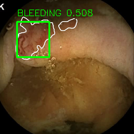

# Auto-WCEBleedGen Challenge Submission

## Table of Achieved Evaluation Metrics

| Dataset    | Metric                                  | Value            |
| ---------- | --------------------------------------- | ---------------- |
| Validation | Classification Accuracy                 | 92.32%           |
| Validation | Classification Recall                   | 92.32%           |
| Validation | Classification F1-Score                 | 94.60%           |
| Validation | Detection Average Precision             | 50.52%           |

## Screenshots/Pictures of Best Validation Results

### Image 1090 (Validation Dataset)

.png)

### Image 1098 (Validation Dataset)

.png)

### Image 1100 (Validation Dataset)

.png)

### Image 1101 (Validation Dataset)

.png)

### Image 1106 (Validation Dataset)

.png)

### Image 1113 (Validation Dataset)

.png)

### Image 1114 (Validation Dataset)

.png)

### Image 1115 (Validation Dataset)

.png)

### Image 1120 (Validation Dataset)

.png)

### Image 1129 (Validation Dataset)

.png)

## Screenshots/Pictures of Best Testing Results (Dataset 1)

### A0013.png (Dataset 1)

### A0028.png (Dataset 1)

### A0045.png (Dataset 1)

### A0046.png (Dataset 1)

### A0047.png (Dataset 1)

<!-- Repeat the pattern for images 3-5 (Dataset 1) -->

## Screenshots/Pictures of Best Testing Results (Dataset 2)

### A0375.png (Dataset 2)

### A0405.png (Dataset 2)

### A0420.png (Dataset 2)

### A0424.png (Dataset 2)

### A0500.png (Dataset 2)

## Repository Structure

The training and testing code is in the repository. Excel prediction files for classification are contained in classification predictions.
Dataset: It includes an annotated dataset in a split 80:20 yolo format.All of the anticipated images from Test Datasets 1 and 2 are present in the detection.
Model_weights: It includes the Yolov8 trained model best.pt, other training data, and plots showing various scores like F1 and others.
Code: Contains the code for every step of the process, divided into sections for testing and training.

## YOLOv8 Detection Model

A yolov8 n model was trained using the bleeding dataset. It recognises the bleeding areas. We employ the same methodology for classification as well; in essence, bleeding is identified if there is a detection.

## How to Run

To run the training, just download the weights(Model_weights/best.pt) and datase(datasets) , then run the training command or script.
To predict run Test.py in the end give the path to model weights, input folder, output folder and the predictions will be stored and will give the predictions along with classification results.

## Conclusion

The Yolov8 model 'n' version has been trained using the dataset. On the default validation dataset that is also kept in the repository, all evaluation metrics are computed.
